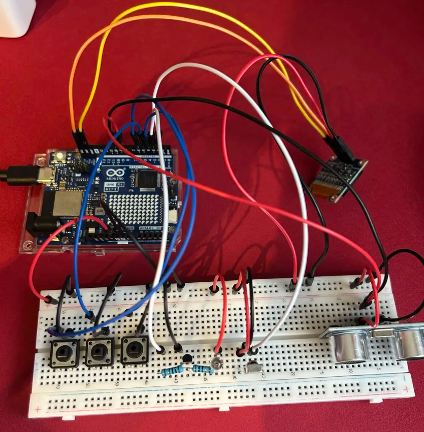
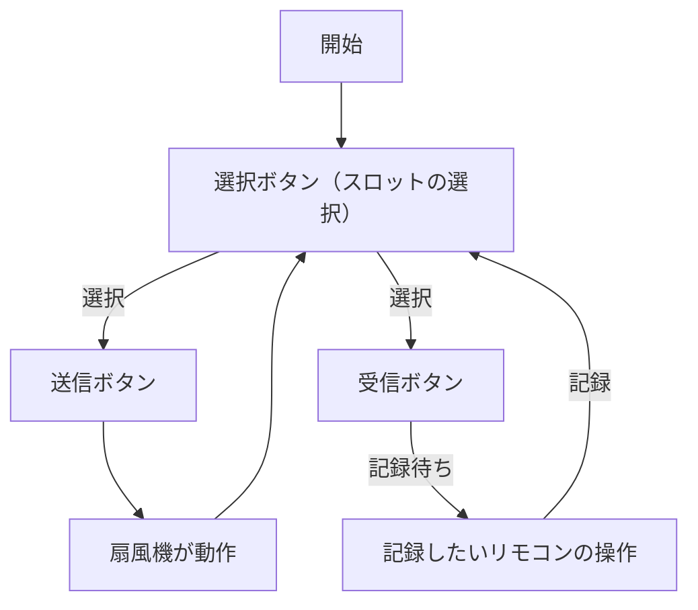
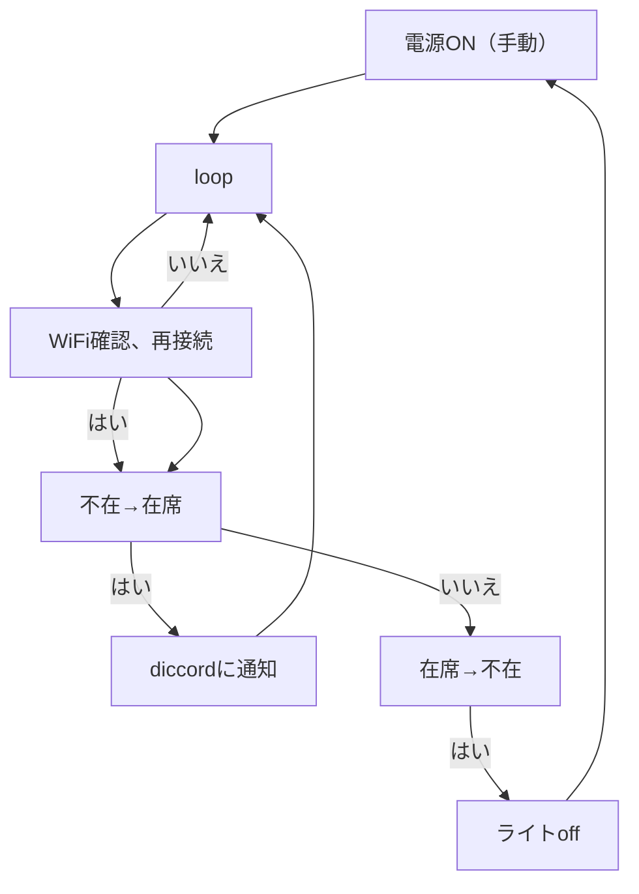
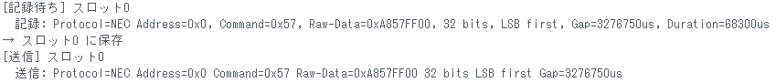
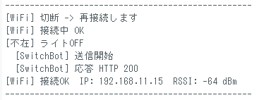
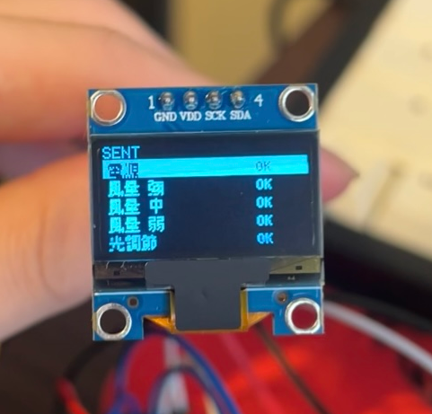

# 個人開発プロジェクト：小型扇風機とスタンドライト

## 1.概要

デスクでの作業を快適にする学習リモコンでの操作が可能な小型扇風機、超音波センサーとスマートプラグ(SwitchBot)を利用した自動で電源のオフが可能なスタンドライト

## 2.主な機能

### 1.赤外線学習リモコン

扇風機のファンのオンオフ、風量調節、ライトの点灯が可能

### 2.OLED表示

OLEDによりリモコンがどのスロットを選択しているのかを閲覧できる

### 3.スタンドライトの電源

超音波センサーで人を検知し、作業が終わりデスクから離れると自動でオフになるスタンドライト(WiFiと電源のオンオフは市販のスマートプラグ(SwitchBot)を使用)

### 4.discord通知

超音波センサーによりデスクに人を検知した際にdiscordに通知がされる機能

## 3.仕様書

### 配線図

> ※配線図には含まれていませんが、スタンドライトはACアダプタを介してswitchbotに繋いでいます

### 仕様モジュール

|部品|個数|用途|接続ピン|
|-|-|-|-|
|Arduino Uno R4 WiFi|1個|通信、制御|USBケーブル|
|卓上扇風機(市販)|1個|出力、送風|USBケーブル|
|スマートプラグ(SwitchBot)|1個|電源の切替|ACアダプター、家庭用コンセント
|OLED|1個|出力、スロットの表示|VCC:5V GND:GND SCK:SCL SDA:SDA|
|超音波センサー|1個|人の検知|VCC:5V GND:GND trig:9 ecuo:10|
|ボタン|3個|リモコン操作|1.GND,D4 2.GND,D5 3.GND,D6|
|IRレシーバダイオード|1個|赤外線受信|VCC:5V GND:GND OUT:D2|
|赤外線エミッタ(送信)|1個|赤外線送信|アノード:5V カソード:抵抗10Ω|
|NPNトランジスタ|1個|制御|コレクタ:抵抗10Ω ベース:1kΩ エミッタ:GND|
|ジャンパワイヤー|約22本|配線|各ピン|
|抵抗1kΩ、10Ω|各1個|制御|1kΩ:D3,ベース 10Ω:コレクタ、カソード|

### フローチャート

- 学習リモコン

- スタンドライト

## 4.導入方法

### セットアップ

- 1.学習リモコン
  - ArduinoIDEのライブラリマネージャで「U8g2」をインストール
  - (任意)スロット名の書き換え
  - ArduinoIDEでスケッチの書き込み
  - 使いたいリモコンをボタンに登録
  - 記録はシリアルモニターで確認可能
  

- 2.スタンドライト
  - SwitchBotのトークン、シークレット、デバイスIDの取得
  [SwitchBot APIの使い方(各IDの取得方法)](https://qiita.com/katta1024/items/6a5af91c986fe3c47f4d)
  - SwitchBotと扇風機の接続
  - [image図](image-3.png)
  - sketchの書き換え、書き込み
    - WiFiのSSIDとパスワード、switchbotのトークン、シークレット、デバイスID、自前のdiscordサーバーで取得したwebhooksのURL
    - 超音波センサーでの検知の距離、不在と認識するまでの時間、スパム防止の通知の最短間隔の設定
    - シリアルモニターで動作確認が可能
  
  
  

## 5.使用方法

- 1.学習リモコン
  - 1.sketch書き込み後、OLEDにスロットが映ります
  - 2.選択ボタンでスロットを選択し、受信ボタンで記録したいリモコンのボタンを登録してください(今回であれば扇風機の赤外線リモコンのボタン。登録されるとスロットに「ok」と表示されます)
  - 3.選択ボタンで任意のスロットを選択した状態で、送信ボタンを押すことで赤外線信号が送られ扇風機が動きます

<video controls src="IMG_7421-1.mov" title="Title"></video>

- 2.スタンドライト
  - 1.作業を開始し、超音波センサーが人を検知するとdiscordに通知が行きます(ライトのonは手動)
   
  - 2.作業が終わり席を離れたことを超音波センサーが検知をするとライトが自動で消えます

<video controls src="IMG_7437.mov" title="Title"></video>